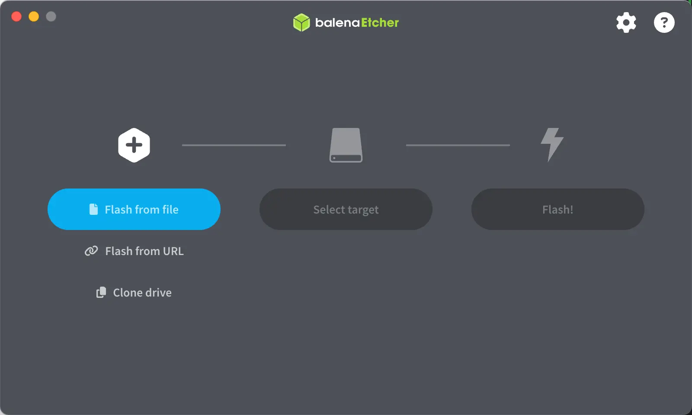
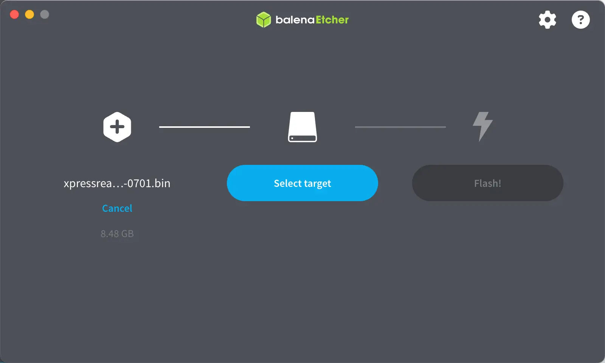
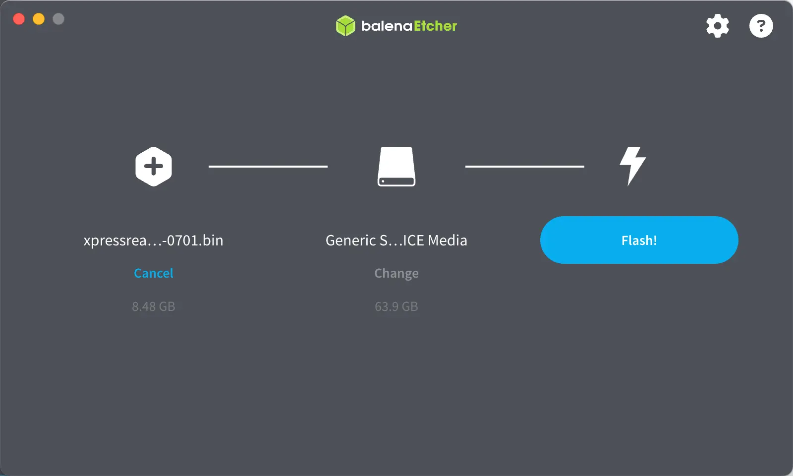

## Introduction and overview

XpressReal T3 is the first SBC in the XpressReal family. Developed in collaboration between Fyde Innovations, Radxa and Realtek, XpressReal T3 is a compact SBC powered by the advanced RTD1619B SoC — delivering robust performance, seamless media processing, extensive developer resources with comprehensive SDK and OS support, and top-tier connectivity in a palm-sized package. Engineered for flexibility, it's the perfect companion for FydeOS Enterprise Kiosk solutions and beyond.

## Preparation

### Power Supply

XpressReal T3 can be powered by Type-C connector with 12V input voltage(your PD power supply need to support this voltage), recommended to use a power supply with a rated maximum current greater than 2A.

### Boot Media

There is no stock firmware in the onboard eMMC, you need to prepare a microSD card with at least 8GB capacity to install the OS image.

If you need to install an image with desktop environment, please use a microSD card with at least 16GB, 32GB is recommended.

### microSD card reader

For flashing the system image.

### Display

The XpressReal T3 has a HDMI video output port on board, which requires a standard HDMI cable to connect to the monitor.

The resolution of the HDMI output depends on the monitor, and the XpressReal T3 will adjust to the optimal display resolution according to the monitor.

### Networking

The XpressReal T3 has a WiFi/BT module on board, which can connect to your wireless network. You can also use a ethernet cable to connect network with the onboard GbE ehternet port.

### Type-C Hub

The XpressReal T3 has a onboard Type-C USB3.0 port. Connect a USB hub to this port if you need more USB connections(Eg. keyboard and mouse)

### openFyde/FydeOS Image Download

Go to [Resource Download](/reference/resource-download/) to download openFyde/FydeOS image file.

### Prepare Installation Media

We recommend using the open-source image flashing tool Etcher, developed by Balena. Etcher has a user-friendly interface and powerful features, with support for Windows, Linux, and macOS systems. Next, we'll show you how to use Etcher to write an image to an SD card.

1. Open Etcher

2. Click `Flash from file` to select the image to flash.

3. Click `Select target` to select the device to write to.

:::danger

Make sure you select the correct device, this operation will erase all data on the device.

:::

4. Click `Flash!` to start writing and wait for the write progress bar to complete.

### Booting the System

* After successfully flashing the microSD card according to the above steps, insert the microSD card into the microSD slot of the XpressReal T3.
* Connect keyboard, mouse and monitor then plug the power supply, the system in the microSD card will boot automatically.

## Further reading

- Read [Install openFyde/FydeOS](/guides/openfyde-fydeos) for how to install openFyde/FydeOS.