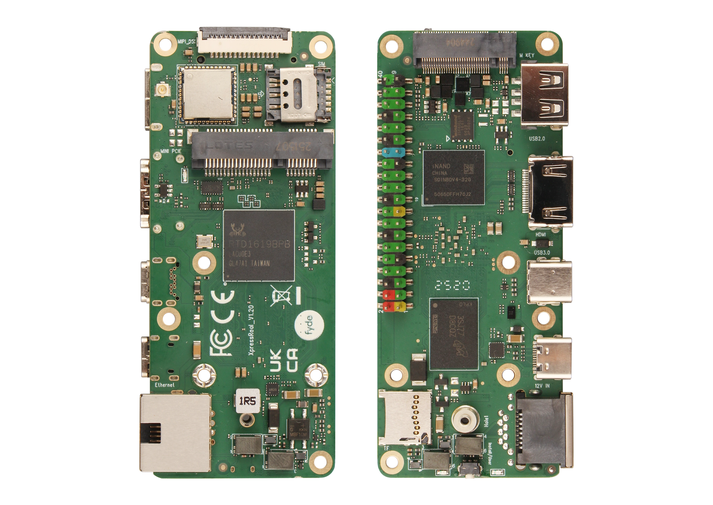

## Product Description

- XpressReal is a family of Single Board Computers developed in collaboration between Fyde Innovations, Radxa and Realtek.
- XpressReal T3 is the first product in the family - a small form factor high performance single board computer powered by the Realtek RTD1619B, which runs FydeOS/openFyde and Linux!
- Equipped with a Quad-core Cortex-A55 processor, up to 4GB LPDDR4x memory and 32GB eMMC.
- Support 4K HDMI output, WiFi6 + BT 5.4, onboard USB3.0, M.2 2280 SSD and 40-pin GPIO interface.
- USB-C PD and GbE with Passive PoE power supply support. 

## Photos

## Features

<table>
    <tr>
        <td align="center">Model</td>
        <td align="center">XpressReal T3</td>
    </tr>
    <tr>
        <td align="center">SoC</td>
        <td colspan="2" align="left">Realtek RTD1619B</td>
    </tr>
    <tr>
        <td align="center">CPU</td>
        <td colspan="2" align="left">Quad-core ARM Cortex-A55, Up to 2.0GHz</td>
    </tr>
    <tr>
        <td align="center">GPU</td>
        <td colspan="2" align="left">ARM Mali-G57 MP1, Vulkan 1.1, OpenGL ES 3.2, OpenCL 2.0.</td>
    </tr>
    <tr>
        <td align="center">NPU</td>
        <td colspan="2" align="left">1.6 TOPS</td>
    </tr>
    <tr>
        <td align="center">RAM</td>
        <td colspan="2" align="left">LPDDR4 3200Mbps, 4GB</td>
    </tr>
    <tr>
        <td align="center">ROM</td>
        <td colspan="2" align="left">
            4MB SPI Flash 
            Onboard eMMC: 32 GB 
            microSD card slot 
            M.2 NVMe SSD slot (M-Key)
        </td>
    </tr>
    <tr>
        <td align="center">Display</td>
        <td colspan="2" align="left">HDMI 2.1a 4K@60Hz, HDMI CEC, ARC/eARC, HDCP support MIPI DSI</td>
    </tr>
    <tr>
        <td align="center">Wireless</td>
        <td colspan="2" align="left">WIFI 6 + BT 5.4 Mini PCIe (AP/4G LTE)</td>
    </tr>
    <tr>
        <td align="center">USB</td>
        <td colspan="2" align="left">1× USB Type-C 3.2 Gen1 1× USB Type-A 2.0</td>
    </tr>
    <tr>
        <td align="center">Other</td>
        <td colspan="2" align="left">40-Pin Header</td>
    </tr>
    <tr>
        <td align="center">Power supply</td>
        <td colspan="2" align="left">
            USB-C PD 
            GbE with Passive PoE
        </td>
    </tr>
    <tr>
        <td align="center">Size</td>
        <td colspan="2" align="left">96mm x 40mm</td>
    </tr>
</table>

## System Block Diagrams

