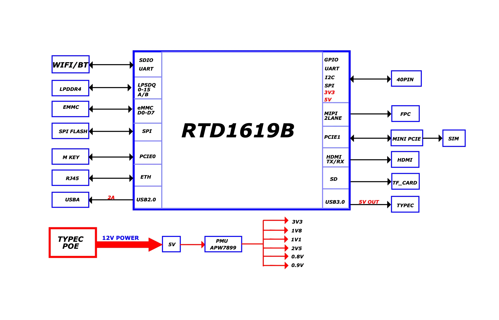

## Product Description

- XpressReal is a small form factor high performance single board computer based on the Realtek RTD1619B, which runs FydeOS/openFyde and Linux!
- Equipped with a Quad-core Cortex-A55 processor, up to 4GB LPDDR4x memory and 32GB eMMC.
- Support 4K HDMI output, WiFi6 + BT 5.4, onboard USB3.0, M.2 2280 SSD and 40-pin GPIO interface.
- USB-C PD and GbE with Passive PoE power supply support. 

## Photos

## Features

<table>
    <tr>
        <td align="center">Model</td>
        <td align="center">XpressReal</td>
    </tr>
    <tr>
        <td align="center">SoC</td>
        <td colspan="2" align="center">Realtek RTD1619B</td>
    </tr>
    <tr>
        <td align="center">CPU</td>
        <td colspan="2" align="center">Quad-core Cortex-A55, up to 1.7GHz</td>
    </tr>
    <tr>
        <td align="center">GPU</td>
        <td colspan="2" align="center">Arm Mali G57 GPU, supports OpenGL ES 3.2, Vulkan 1.0, and OpenCL 2.0.</td>
    </tr>
    <tr>
        <td align="center">NPU</td>
        <td colspan="2" align="cneter">1.6 TOPS</td>
    </tr>
    <tr>
        <td align="center">RAM</td>
        <td colspan="2" align="center">4 GB LPDDR4x</td>
    </tr>
    <tr>
        <td align="center">ROM</td>
        <td align="center">
            SPI Nor Flash 
            Onboard eMMC: 32 GB 
            microSD card 
            M.2 2280
        </td>
    </tr>
    <tr>
        <td align="center">Display</td>
        <td colspan="2" align="center">HDMI x 1，4K60p MIPI DSI</td>
    </tr>
    <tr>
        <td align="center">Wireless</td>
        <td align="center">WIFI 6 + BT 5.4 Mini PCIe (AP/4G LTE)</td>
    </tr>
    <tr>
        <td align="center">USB</td>
        <td colspan="2" align="center">USB 3.0 Type-C HOST x1 USB 2.0 Type-A x1</td>
    </tr>
    <tr>
        <td align="center">Other</td>
        <td colspan="2" align="center">40-Pin Header</td>
    </tr>
    <tr>
        <td align="center">Power supply</td>
        <td colspan="2" align="center">
            USB-C PD 
            GbE with Passive PoE
        </td>
    </tr>
    <tr>
        <td align="center">Size</td>
        <td colspan="2" align="center">96mm x 40mm</td>
    </tr>
</table>

## System Block Diagrams

## Guide Documentation

### [Getting started](/guides/getting-started)

### [openFyde](/guides/openfyde)

### [Other Systems](/guides/other-systems)

### [Building openFyde](/guides/building-openfyde)

### [Building Yocto](/guides/building-yocto)