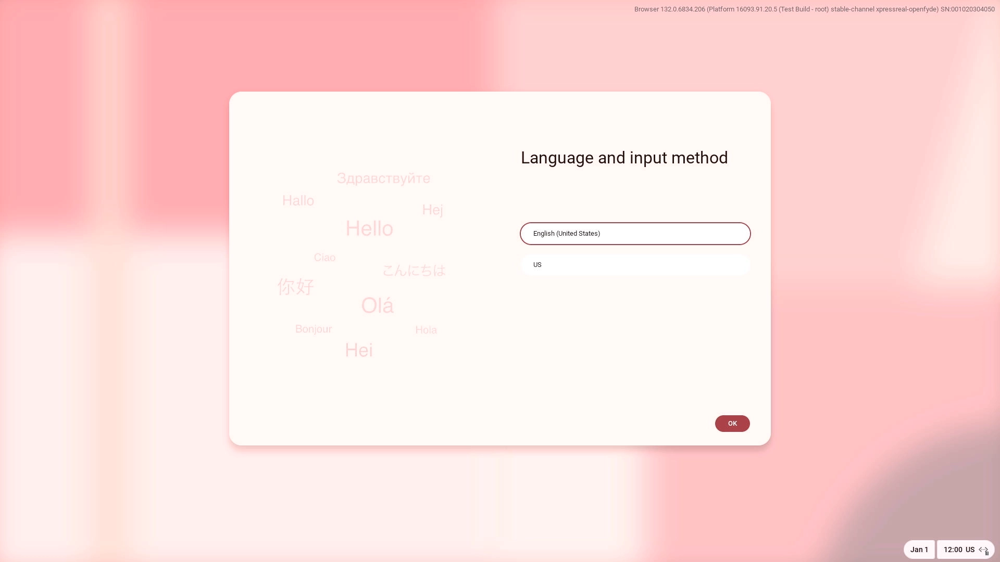
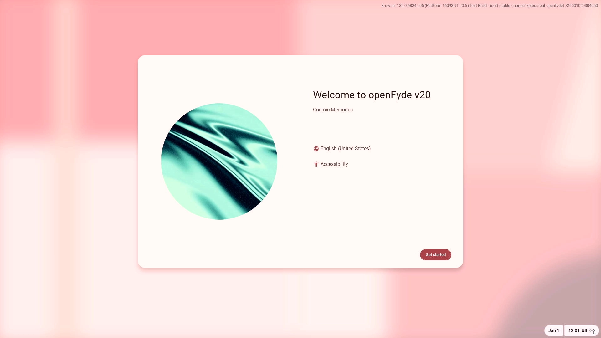
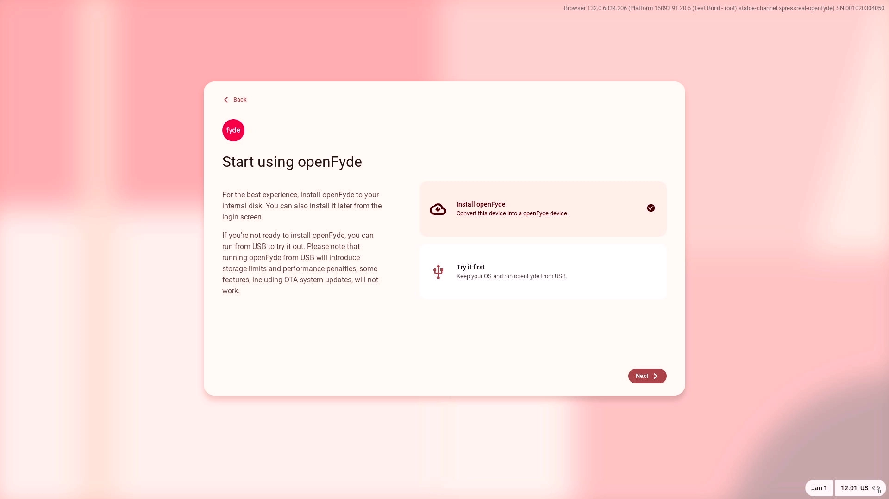
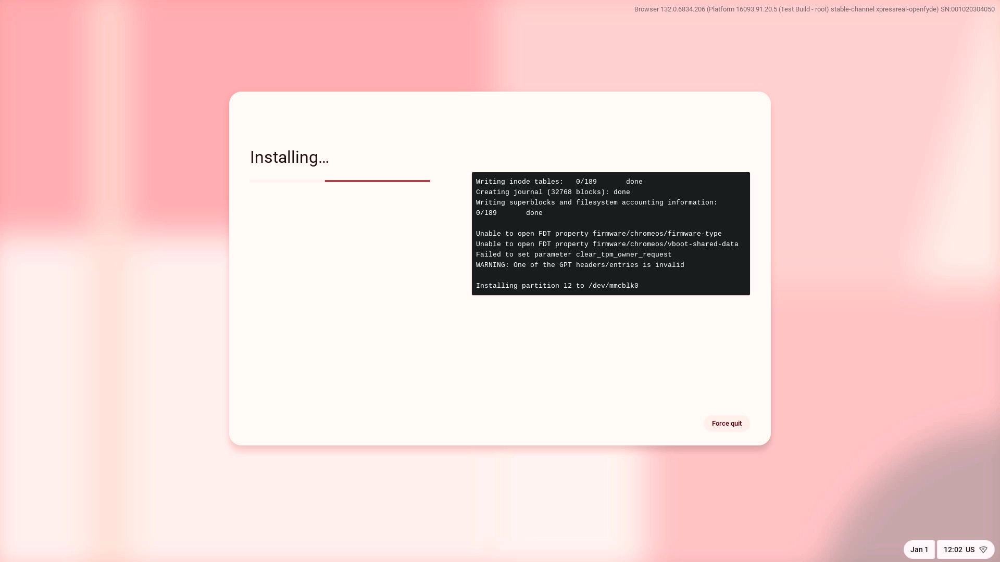
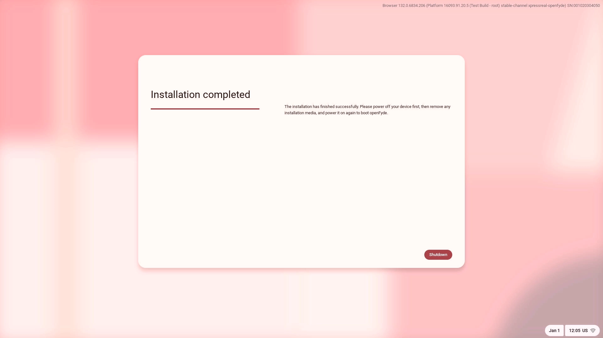
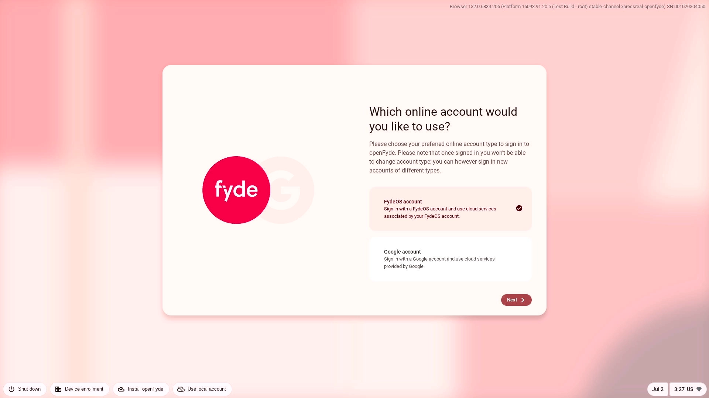
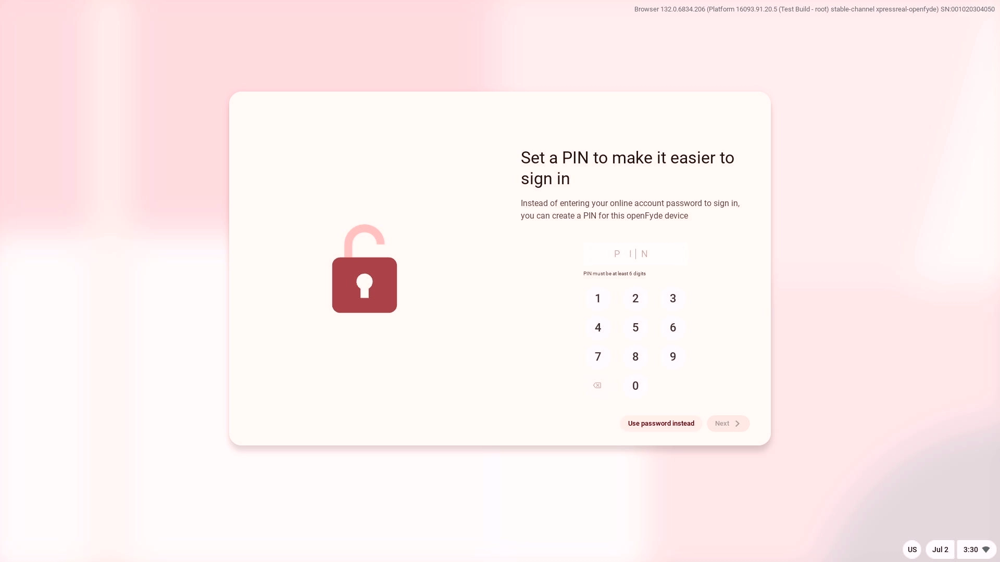
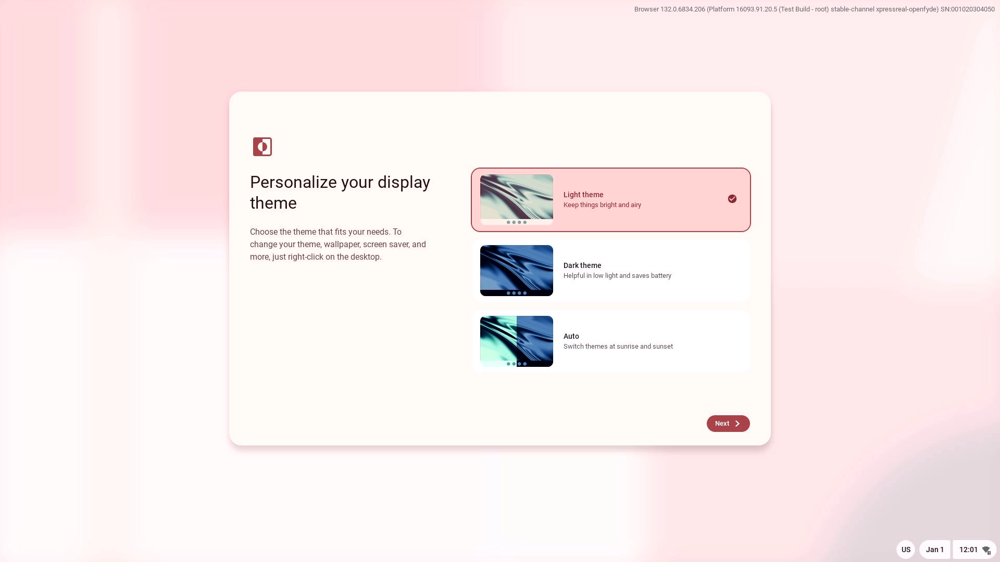
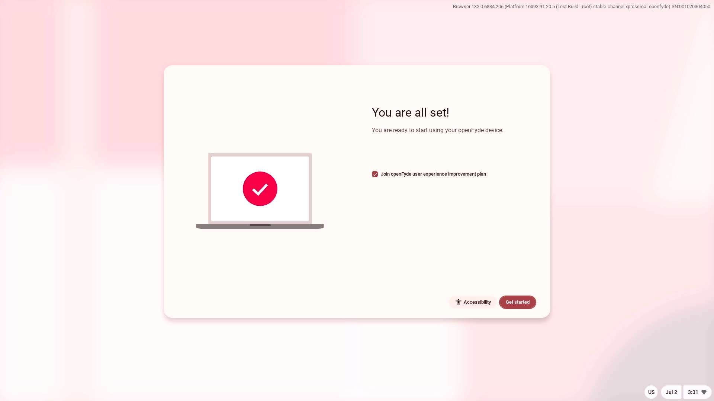

## openFyde/FydeOS

openFyde is an open-source initiative started by Fyde Innovations, the creator of FydeOS, with an aim to provide another approach to Chromium OS. With openFyde, you can have a more open and flexible Chromium OS. At Fyde Innovations we believe with more choices comes greater possibilities.

In a one-liner: openFyde is Chromium OS open-sourced instead of open-core, with or without Google.

FydeOS is based on openFyde, with proprietary/commercial/licensed packages that are not included in openFyde, providing a more complete and stable experience.

## Install and setup

> The following steps use openFyde as an example, as the installation method is almost the same for openFyde and FydeOS.

With the openFyde boot media inserted into the microSD slot, it will boot automatically when power on the device.

The following section with guide you to install openFyde/FydeOS into the onboard eMMC storage step by step.

### Select language

Select your language and input method the click `OK` to proceed.

### Welcome

The welcome page will display, just Click `Get started` to get to the next page.

### Installation

Select `Install openFyde` to install openFyde to the internal storage(eMMC), if you prefer to try it before installing it to eMMC, select `Try it first`. You can always choose to install it to internal storage by clicking `Install openFyde` button during trying it.

Select the target storage you want the openFyde to install to. For the onboard eMMC, it should be `/dev/mmcblk0`, click `Install` to start the installation.

It will take about 5~10 minutes for the installation depending on the speed of your microSD card, be patient to wait it finish.

When the installation is finish, click `Shutdown` to shutdown the device, then unplug the microSD card from slot and replug the power supply to boot.

### Account setup

After installation and reboot, you can login into openFyde with a `FydeOS account` or `Google account`, click `Next` to login with your account.

You can create a FydeOS account if you don't have one in the FydeOS account login page by clicking the `Signup` button.

You can also choose to use local account to login the system by click `Use local account` button.

:::note

some online service will not available with local account.

:::

Setup login PIN if you prefer to use PIN to login

### Finish

Term of Service agreement and theme selection.

Congratulations! openFyde has been setup in your device.

## Further reading

- Read [Building openFyde](/guides/building-openfyde) for how to build openFyde image.