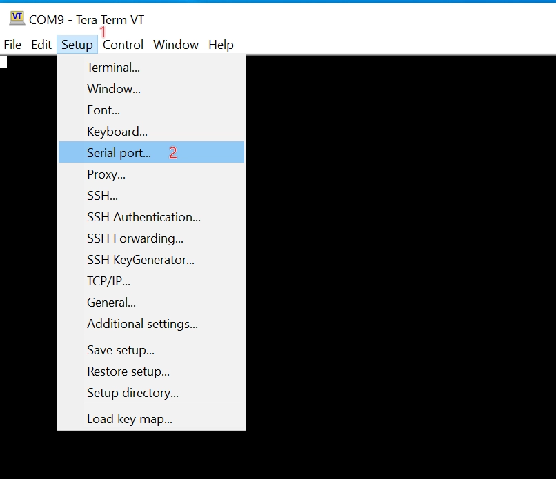
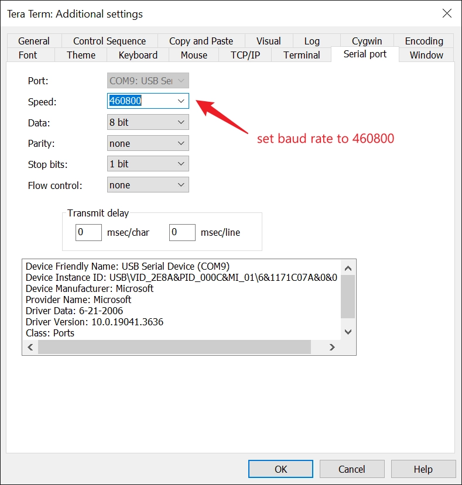
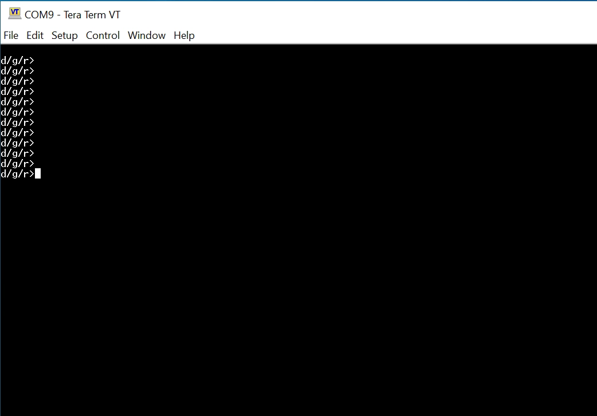
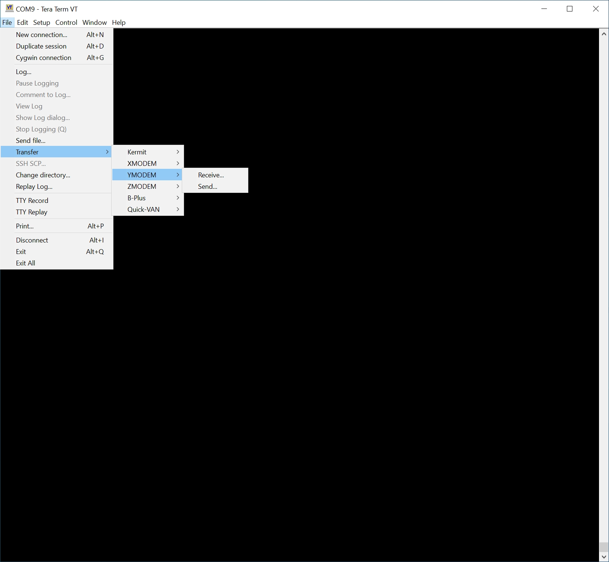
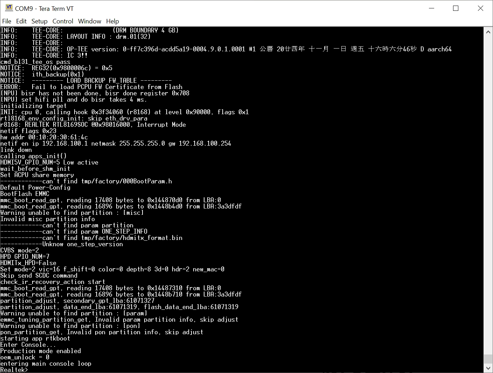
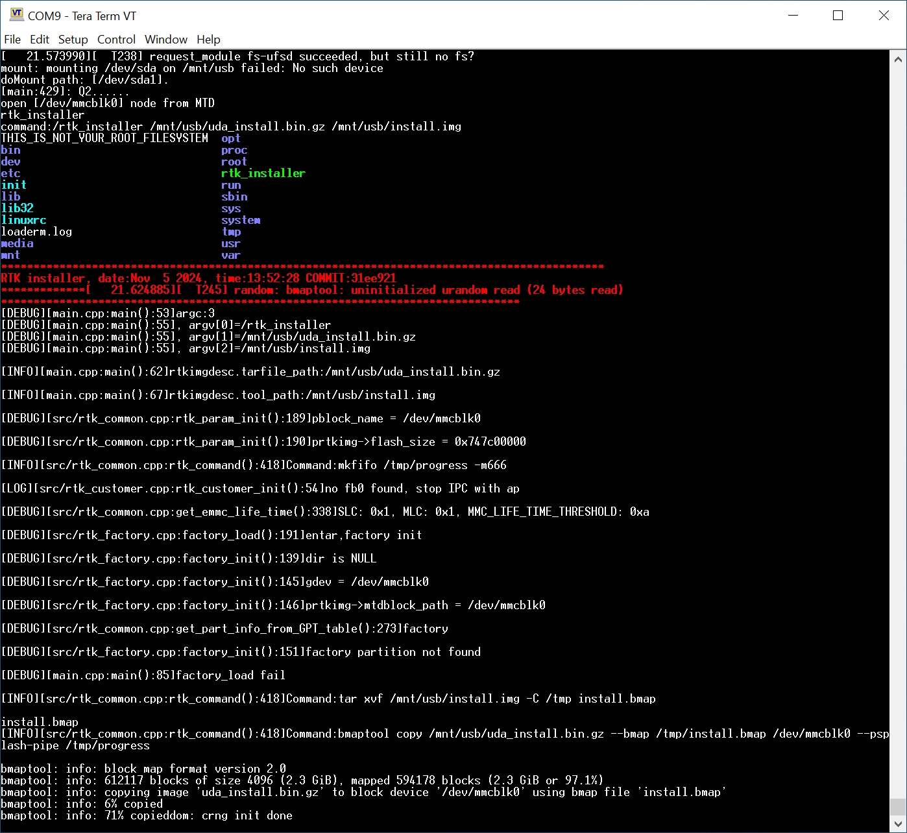
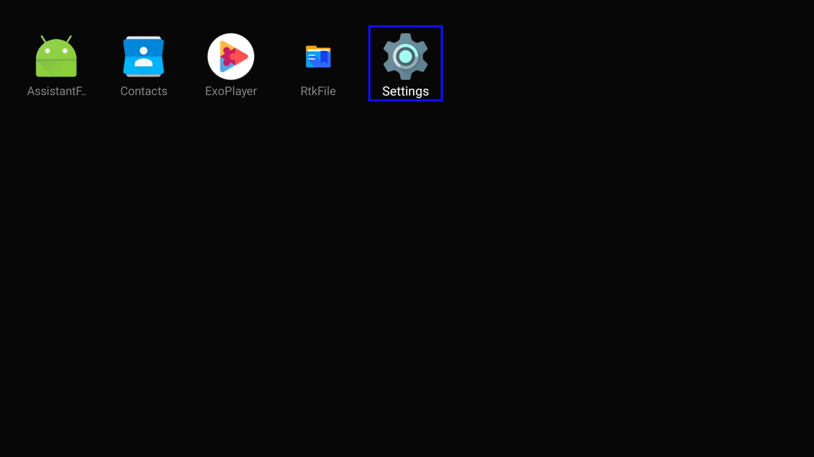

In addition to openFyde, the XpressReal supports other operating systems, such as Linux and Android. 
You can download the OS images from our [Resource Download](/reference/resource-download/) page to 
experiment with different systems.

## Install Custom Linux Image

Our Linux OS images are built with the Yocto Project. Use `balenaEtcher` to flash a downloaded image to a microSD card, then boot your XpressReal from it.
Refer to the [Getting Started Guide](/guides/getting-started/) for flashing instructions.

## Install Android OS Image

Installing the Android image requires flashing files via the RTD1619B chip's recovery mode. 
First, ensure the serial port is connected correctly as described in the [Hardware Interface](/reference/hardware-interface/#uart-serial-console) document.

Next, download the Android Image from our Resource Download page and extract the .zip archive. 
You will find two folders inside: `lk` and `image`. The contents are used as follows: 
files in the `lk` folder need to be uploaded to the XpressReal through the serial port, 
while files in the `image` folder need to be copied to a USB drive.

:::caution

Please ensure that your serial terminal software supports file transfers via the Y-modem protocol.
For Windows users, we recommend using [Tera Term](https://teratermproject.github.io/index-en.html).

:::

### 0. Serial setup

Connect serial to XpressReal, set the baud rate to `460800` in Tera Term:





### 1. Enter recovery mode

With baud rate seting up, connect serial port in Tera Term. Pressing `ctrl-q` the power up the XpressReal,
it will enter recovery mode:



### 2. Upload files with Y-modem

Press `h` in keyboard, then send `RTD1619B_hwsetting_BOOT_LPDDR4_32Gb_ddp_s1600_final.bin` file by Y-modem protocol:



Press `d` in keyboard, then send `uda_emmc.bind.bin` file, when it finished, press `g` to write uploaded file to eMMC.

Press `d` in keyboard, then send `boot_emmc.bind.bin` file, when it finished, press `b1` and `b2` to write uploaded file to eMMC.

### 3. Reboot to uboot

After upload and write those files, replug the power supply to reboot XpressReal, it will enter uboot by default:



Enter the following commands to setup sysparam

```
sysparam default
sysparam save
```

### 4. Copy image to USB disk

Copy all the files in `image` folder to the root of the USB disk, then plug the USB disk to the USB 3.0 Type-C port.

:::caution

Make sure the file system of your USB disk is `FAT32` and the sector size of `FAT32` is `512` because
the uboot XpressReal used only support this sector size.

Your can prepare the file system with the this command in a Linux console:
```bash
mkfa.vfat -S 512 /dev/sdXXX
```

:::

### 5. Install Android to eMMC

Plug the USB disk to XpressReal, type `boot ru` in uboot to start the installation:



Wait for a while, when it finished, XpressReal will reboot to Android.




## Further reading

- Read [Building Custom Linux](/guides/building-yocto) for how to build system images using yocto.