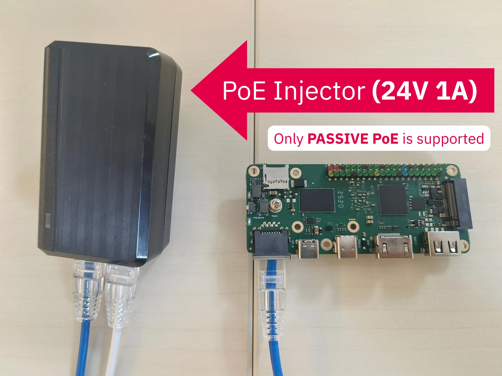

## What is Passive PoE?

Passive Power over Ethernet (PoE) is a method of delivering power to a device through an Ethernet cable without following the IEEE 802.3af/at PoE standards. Unlike active or standard PoE, there is no negotiation between the power source and the powered device. Instead, a fixed voltage is directly applied to the cable pairs.

This makes Passive PoE simple and inexpensive, but also less flexible and potentially risky if the wrong voltage or polarity is used.

## Supported Specification on XpressReal T3

The XpressReal T3 only supports Passive PoE at **24V / 1A**.

- Connecting the board to a standard 802.3af/at PoE switch is **not supported** and may damage the hardware.
- A dedicated Passive PoE injector must be used to supply power.

## How to Use Passive PoE on XpressReal T3

1. Prepare a 24V / 1A Passive PoE injector.
2. Connect the injector's LAN port to your router or switch.
3. Connect the injector's PoE output port to the XpressReal T3 Ethernet port using a standard Ethernet cable.
4. Ensure that the voltage and polarity are correct before powering on.

## Important Notes

- **Always double-check the voltage rating** of your injector. Using a higher voltage may permanently damage the board.
- Since there is no handshake, the system will begin drawing power as soon as the cable is connected.
- For development or testing purposes, you may also power the XpressReal T3 through the dedicated DC input port instead of PoE.