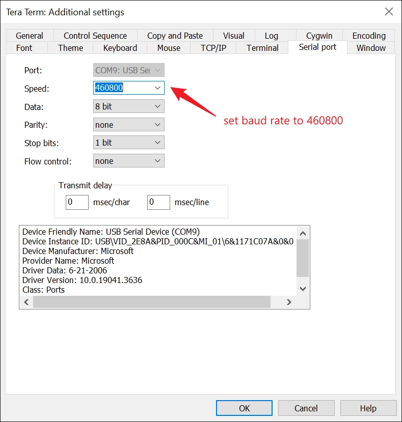
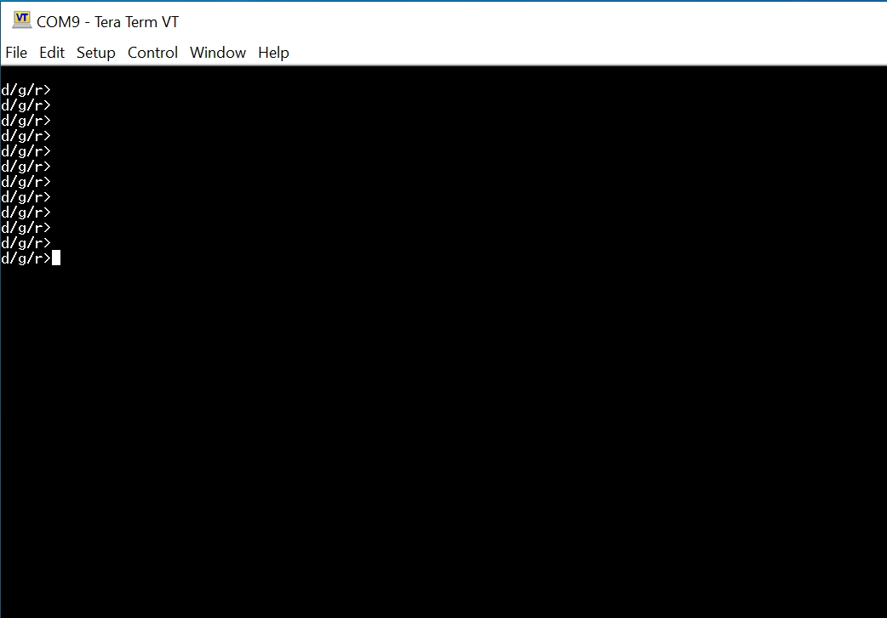

Has your XpressReal T3 turned into a brick after a custom firmware experiment gone wrong? Don't worry—this guide will help you bring it back to life.

:::note

- The unbricking process requires executing commands via the serial port (UART). You will need a USB-to-TTL converter that supports 3.3V.
- The firmware file is transferred using the Y-modem protocol. Please ensure that your serial terminal software supports this protocol. On Windows, we recommend using [Tera Term](https://teratermproject.github.io/index-en.html).

:::

### Download recovery firmware

Go to [XpressReal T3 FW Repo](https://github.com/XpressReal/xpressreal/tree/main/recovery-fw) to download the recovery firmware.

### Setup UART serial console

- Connect your USB-to-TTL convert according to the instructions in the [Hardware Interface](/reference/hardware-interface/#uart-serial-console) document.

- Set serial port baud rate to `460800` in Tera Term:

### Enter recovery mode

After setting the baud rate for the serial port, connect to it in Tera Term. Press and hold the ctrl-q keys on your keyboard, and then power on the XpressReal T3. The XpressReal T3 will enter Recovery mode and display the following interface:

### Upload and flash firmware

- Press `h` on keyboard, then upload `RTD1619B_hwsetting_BOOT_LPDDR4_32Gb_ddp_s1600_final.bin` file by Y-modem protocol.

- Press `d` on keyboard, then upload `rtd1619b_emmc_bind_4gb.bin` file by Y-modem protocol. Wait for the file upload to complete, then use the keyboard to enter `b1` and `b2`. This will write the uploaded firmware to the `Boot Area1` and `Boot Area2` of the eMMC.

### Done

Congratulations! Your XpressReal T3 has been restored to its factory state. You can now refer to the [Getting Started](/guides/getting-started) guide to install an operating system.