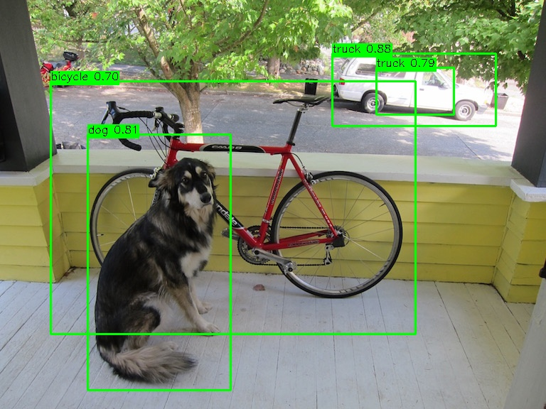

--- 
title: Run neural network with NPU
description: Guide on how to run a neural network(yolov4tiny) with NPU acceleration on XpressReal T3.
---

The XpressReal T3 is equipped with an NPU that delivers 1.6 TOPS of computing performance, which can be used to accelerate neural network models.

The following steps provide an example of running the Yolov4 Tiny model with the NPU on the Armbian system.

First, you need to confirm that the Armbian system you are using has loaded the kernel driver module for the NPU:

```bash
lsmod | grep galcore
```

Then, use the following command to download the npu‑sdk to your device, compile and run it.

```bash
# install prerequisites
sudo apt install -y build-essential libopencv-dev

git clone https://github.com/XpressReal/npu-sdk.git
cd npu-sdk/yolov4tiny/
make -f makefile.linux
# change NPU device node permission for user access
sudo chmod 0666 /dev/galcore
# Run the sample against the provided dog image
export LD_LIBRARY_PATH=../acuity-root-dir/lib/arm64/1619b
./bin_r/yolov4tinyuint8 ./model/yolov4tiny.nb ./input/dog.jpg

```

After running the Yolov4 Tiny model, a file named yolov4_tiny_result.jpg will be generated, in which the detected objects will be marked.

