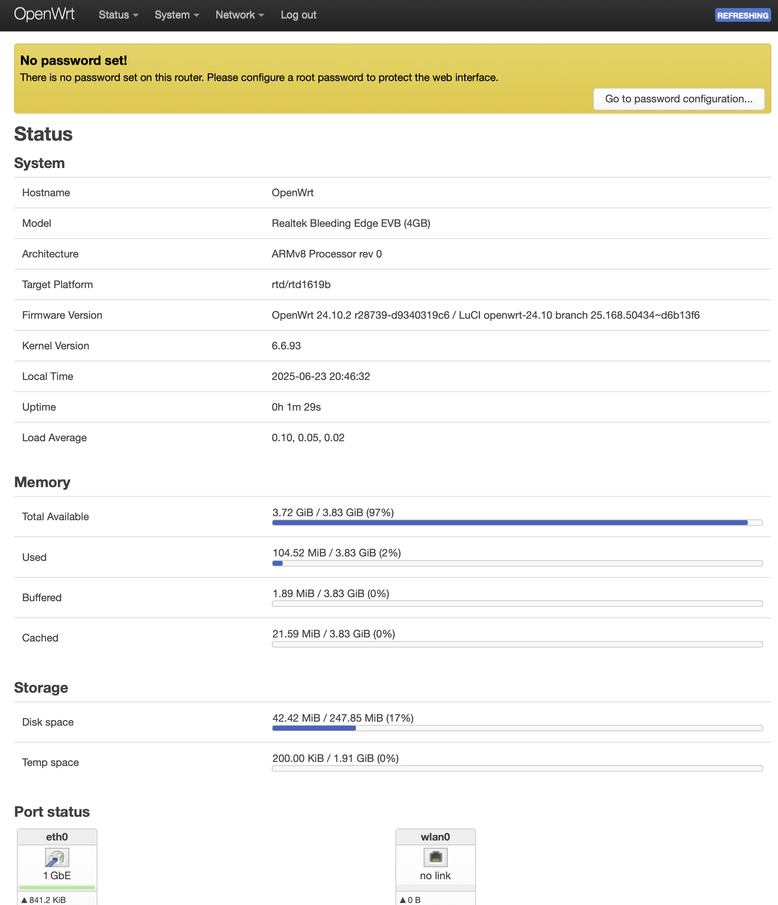
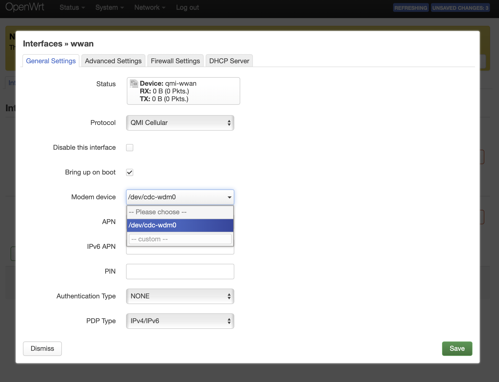
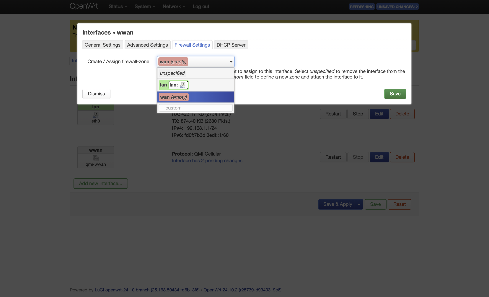

This guide explains how to configure the Quectel EC25 modem as a WWAN (Wireless Wide Area Network) interface on an XpressReal board running OpenWrt. The EC25 is a popular LTE module that can provide mobile connectivity for embedded systems.

What you will need:
- XpressReal board with OpenWrt installed
- Quectel EC25 LTE module
- SIM card with an active data plan
- Antennas for the EC25 module

## Prerequisites
Insert the EC25 module into the mini PCIe slot on the XpressReal board and ensure that it is properly seated. Connect the necessary antennas to the EC25 module for optimal signal reception.

## Step 1: Check if the LTE modem is recognised
The recommended way to use the EC25 is via QMI mode, which allows for better control and management of the modem.
To check if the EC25 is recognised in QMI mode, run the following command in the terminal:
```sh
ls /dev/cdc-wdm*
```
If the output shows `/dev/cdc-wdm0`, then the EC25 is recognised correctly; otherwise, the module might be operating in a different mode.

To switch the EC25 LTE module to the correct mode, use picocom to send the appropriate AT command:
connect to the modem at 115200 baud
```sh
picocom -b 115200 /dev/ttyUSB3
```
check the current mode; it might return 1 for RNDIS mode or 2 for MBIM mode
```sh
AT+QCFG="usbnet"
```
send the command to switch to QMI mode
```sh
AT+QCFG="usbnet",0
```
restart the modem to apply the changes
```sh
AT+CFUN=1,1
```
After the modem restarts, check again if `/dev/cdc-wdm0` is present.

## Step 2: Configure the WWAN interface in the OpenWrt web interface
1. Log in to the OpenWrt web interface (LuCI).

2. Navigate to **Network** > **Interfaces**.
3. Click on **Add new interface...**.
4. Set the following parameters:
    - **Name**: `wwan`  (or any name you prefer)
    - **Protocol**: `QMI`

5. Click **Create Interface**.
6. In the new interface configuration page, set the following parameters:
    - **Device**: `/dev/cdc-wdm0`
    - **APN**: Set this to your network's APN (e.g. `internet` for many networks).
    - **Username**: Leave blank unless your network requires it.
    - **Password**: Leave blank unless your network requires it.

7. Go to the **Firewall Settings** tab and assign the `wwan` interface to the appropriate firewall zone (usually `wan`).

8. Click **Save & Apply**.

## Step 3: Verify the connection
After applying the settings, the `wwan` interface should connect automatically. You can verify the connection by checking the interface status:
1. Go to **Network** > **Interfaces**.
2. Check the `wwan` interface status to see if it has obtained an IP address and is connected.
If everything is set up correctly, you should now have internet access via the EC25 modem.