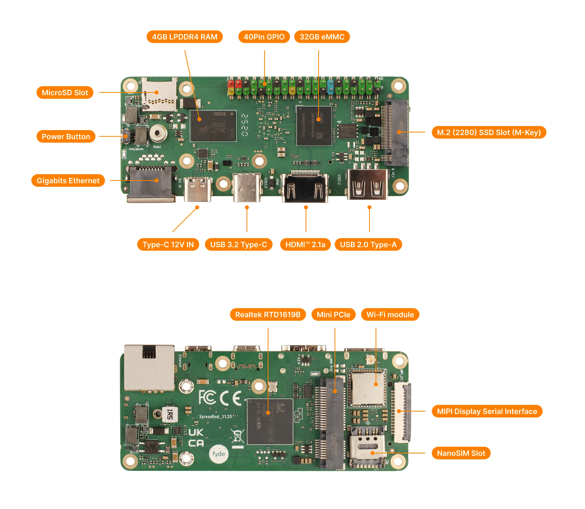

## Interface overview

## 40-PIN GPIO

#### GPIO voltage

|   GPIO   | Voltage | Max  |
| :------: | :-----: | :--: |
| All GPIO |  3.3V   | 3.3V |

#### GPIO Interface

The XpressReal provides a 40 pin GPIO header that is compatible with most peer accessories on the market.

|   Function2   | Function1  |    Pin#     |    Pin#     | Function1  |     Function2   |
| :-----------: | :--------: | :---------: | :---------: | :--------: | :-------------: |
|               |   +3.3V    |     1       |      2      |   +5.0V    |                 |
|  I2C5_SDA     |  I2C7_SDA  |     3       |      4      |   +5.0V    |                 |
|  I2C5_SCL     |  I2C7_SCL  |     5       |      6      |    GND     |                 |
|  TP0_DATA0    |  GPIO2_B3  |     7       |      8      |  GPIO4_C3  |    UARTO_TX     |
|               |    GND     |     9       |      10     |  GPIO4_C4  |    UARTO_RX     |
|  TP0_DATA1    |  GPIO4_C2  |     11      |      12     |  GPIO4_A3  |    TP0_SYNC     |
|  TP0_DATA2    |  GPIO4_C6  |     13      |      14     |    GND     |                 |
|  TP0_DATA3    |  GPIO4_D0  |     15      |      16     |  GPIO4_D2  |    TP0_VALID    |
|               |   +3.3V    |     17      |      18     |  GPIO4_D4  |    TP0_CLK      |
|  GSPI_MOSI    |  GPIO1_B0  |     19      |      20     |    GND     |                 |
|  GSPI_MISO    |  GPIO1_A7  |     21      |      22     |  GPIO4_D5  |    IR_RX        |
|  GSPI_SCK     |  GPIO1_B1  |     23      |      24     |  GPIO4_B2  |    GSPI_CS      |
|               |    GND     |     25      |      26     |  ADC_IN0   |    SPDIF_IN     |
|  I2C3_SDA     |  GPIO2_A0  |     27      |      28     |  GPIO2_A1  |    I2C3_SCL     |
|  TP0_DATA4    |  GPIO2_B2  |     29      |      30     |    GND     |                 |
|  TP0_DATA4    |  GPIO2_B1  |     31      |      32     |  GPIO3_C0  |    VDAC_VO      |
|  TP0_DATA4    |  GPIO2_B4  |     33      |      34     |    GND     |                 |
|  TP0_DATA4    |  GPIO4_A5  |     35      |      36     |  GPIO4_A4  |    SPDIF_OUT    |
|  GPIO_22      |  GPIO4_D6  |     37      |      38     |  GPIO4_A6  |    ADAC_AOR     |
|               |    GND     |     39      |      40     |  GPIO4_A7  |    ADAC_AOL     |

## UART Serial Console

Using an USB to TTL converter to connect to the serial port of XpressReal.

| XpressReal SBC  | Connection  | Serial Cable |
| --------------- | ----------- | ------------ |
| **GND** (pin 6) | &lt;---&gt; |    **GND**   |
| **TX** (pin 8)  | &lt;---&gt; |    **RX**    |
| **RX** (pin 10) | &lt;---&gt; |    **TX**    |

:::note

* the voltage of serial pins are +3.3V
* baud rate is 460800

:::